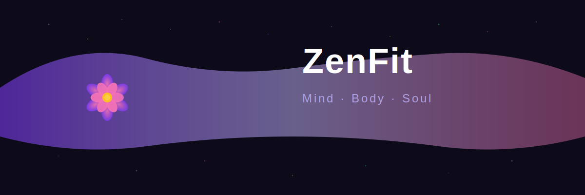
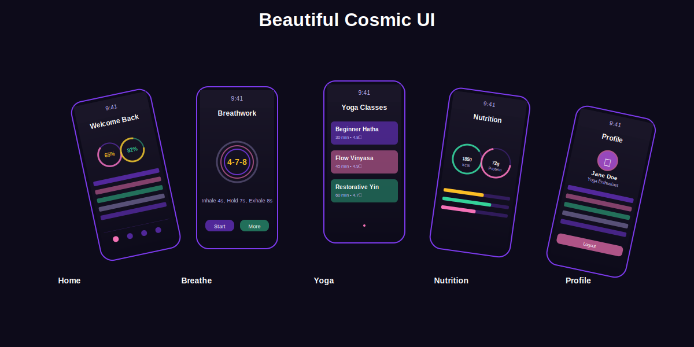
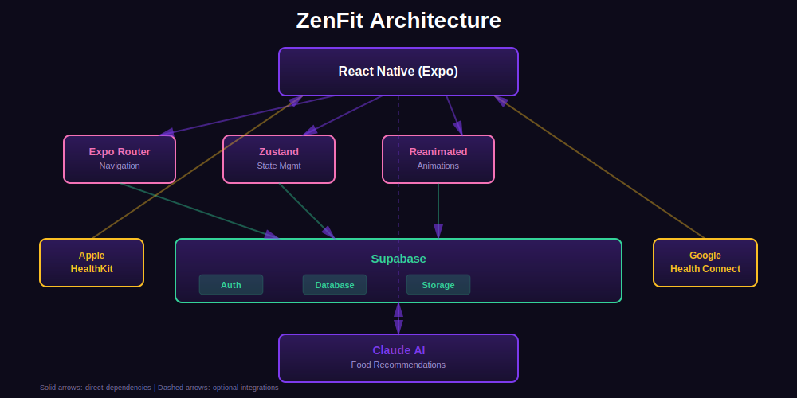

**ZenFit API Reference v1.0.0**

***

<p align="center">
  
</p>

<h1 align="center">ZenFit</h1>
<h3 align="center">Mind · Body · Soul</h3>

<p align="center">
  A beautiful, open-source cross-platform fitness app built with React Native & Expo — blending yoga, meditation, AI nutrition, and smart health tracking into one cosmic experience.
</p>

<p align="center">
  <a href="#features">Features</a> •
  <a href="#screenshots">Screenshots</a> •
  <a href="#tech-stack">Tech Stack</a> •
  <a href="#getting-started">Getting Started</a> •
  <a href="#architecture">Architecture</a> •
  <a href="#contributing">Contributing</a> •
  <a href="#license">License</a>
</p>

<p align="center">
  
  
  
  
  
  
</p>

---

## Features

ZenFit is a comprehensive fitness companion that goes beyond basic workout tracking. It combines physical fitness, mental wellness, smart nutrition, and wearable integration into a single, beautifully designed app.

**Core Features:**

- **Yoga & Meditation** — Guided yoga classes (Hatha, Vinyasa, Kundalini, Yin, Power) with HD video streaming and a dedicated breathing exercise timer (4-7-8 technique)
- **AI-Powered Nutrition** — Location-aware food recommendations powered by Claude AI, macro tracking with protein/carbs/fat rings, and meal logging
- **Smart Health Tracking** — Step counter with background tracking, heart rate monitoring with zone indicators (Rest, Fat Burn, Cardio, Peak), and daily water intake tracker
- **Wearable Integration** — Connects with Apple Watch (HealthKit) and Android watches (Health Connect) for real-time heart rate and activity sync
- **Beauty & Wellness Tips** — Gender-specific skincare, grooming, and post-workout beauty routines with video tutorials
- **Gamification** — XP system, levels, streak tracking, achievement badges, and weekly challenges to keep you motivated
- **HD Exercise Videos** — Categorized workout library covering yoga, meditation, strength, cardio, HIIT, and breathing exercises with offline download support
- **Smart Reminders** — Customizable notifications for water intake, meals, supplements, workouts, meditation, and sleep
- **Single Premium Plan** — Simple, honest pricing with one plan that unlocks everything (7-day free trial, no credit card required)

## Screenshots

<p align="center">
  
</p>

## Tech Stack

| Layer | Technology | Purpose |
|-------|-----------|---------|
| **Framework** | React Native + Expo | Cross-platform iOS & Android |
| **Language** | TypeScript | Type safety throughout |
| **Navigation** | Expo Router | File-based routing |
| **State** | Zustand | Lightweight state management |
| **Backend** | Supabase | Auth, PostgreSQL DB, Storage |
| **Animations** | React Native Reanimated | Smooth 60fps animations |
| **AI** | Claude API | Smart food recommendations |
| **Wearables** | HealthKit + Health Connect | Watch data sync |
| **Payments** | Stripe | Subscription billing |

<p align="center">
  
</p>

## Getting Started

### Prerequisites

- Node.js 18+ and npm
- Expo CLI (`npm install -g expo-cli`)
- iOS Simulator (macOS) or Android Emulator
- A [Supabase](https://supabase.com) account (free tier works)

### Installation

```bash
# Clone the repository
git clone https://github.com/yourusername/zenfit.git
cd zenfit

# Install dependencies
npm install

# Copy environment variables
cp .env.example .env
```

### Supabase Setup

1. Create a new project at [supabase.com](https://supabase.com)
2. Go to **SQL Editor** and paste the contents of `supabase/schema.sql`
3. Click **Run** to create all 14 tables with Row Level Security
4. Go to **Settings → API** and copy your Project URL and Anon Key
5. Paste them into your `.env` file

### Running the App

```bash
# Start Expo development server
npx expo start

# Run on iOS Simulator
npx expo start --ios

# Run on Android Emulator
npx expo start --android

# Run on Web
npx expo start --web
```

### Running Tests

```bash
# Run all unit & integration tests
npm test

# Run with coverage report
npm test -- --coverage

# Run E2E tests with Detox (iOS)
detox test --configuration ios.sim.debug

# Run E2E tests with Detox (Android)
detox test --configuration android.emu.debug
```

## Project Structure

```
zenfit/
├── app/                        # Expo Router screens
│   ├── _layout.tsx             # Root layout + auth gate
│   ├── index.tsx               # Splash screen
│   ├── onboarding.tsx          # 3-step onboarding
│   ├── auth.tsx                # Sign in / Sign up
│   └── (tabs)/                 # Bottom tab navigator
│       ├── _layout.tsx         # Tab bar configuration
│       ├── index.tsx           # Home dashboard
│       ├── breathe.tsx         # Breathing exercises
│       ├── yoga.tsx            # Yoga class library
│       ├── nutrition.tsx       # Diet & nutrition tracking
│       └── profile.tsx         # User profile & settings
├── src/
│   ├── theme/colors.ts         # Design system tokens
│   ├── lib/supabase.ts         # Supabase client
│   ├── store/authStore.ts      # Zustand auth store
│   ├── screens/                # Additional screens
│   │   ├── RemindersScreen.tsx
│   │   ├── SubscriptionScreen.tsx
│   │   ├── BeautyTipsScreen.tsx
│   │   ├── ProgressScreen.tsx
│   │   ├── StepsScreen.tsx
│   │   └── VideosScreen.tsx
│   ├── components/             # Reusable components
│   ├── hooks/                  # Custom React hooks
│   ├── services/               # API service layer
│   ├── types/                  # TypeScript type definitions
│   └── utils/                  # Utility functions
├── supabase/
│   └── schema.sql              # Complete database schema
├── __tests__/                  # Test suite
│   ├── screens/                # Screen component tests
│   ├── store/                  # Store tests
│   └── e2e/                    # E2E integration tests
├── e2e/                        # Detox E2E tests
├── docs/                       # Documentation
│   ├── API.md                  # API reference
│   ├── SETUP.md                # Detailed setup guide
│   └── ARCHITECTURE.md         # Architecture docs
└── assets/                     # Images, fonts, icons
```

## Database Schema

ZenFit uses 14 PostgreSQL tables with Row Level Security:

| Table | Description |
|-------|------------|
| `profiles` | User profiles (extends Supabase auth) |
| `subscriptions` | Premium plan billing |
| `diet_plans` | Custom meal plans with macros |
| `meals` | Individual meal logs |
| `reminders` | Scheduled notifications |
| `daily_steps` | Step count per day |
| `heart_rate_logs` | Heart rate readings from wearables |
| `beauty_tips` | Curated beauty & wellness content |
| `food_recommendations` | AI-generated local food suggestions |
| `exercise_videos` | Workout video library |
| `water_logs` | Daily water intake tracking |
| `meditation_sessions` | Meditation session history |
| `achievements` | Badge definitions |
| `user_achievements` | Unlocked badges per user |
| `yoga_classes` | Yoga class library |

## Design System

ZenFit uses a cosmic dark theme inspired by yoga and meditation aesthetics:

| Token | Color | Usage |
|-------|-------|-------|
| Deep Violet | `#7C3AED` | Primary accent, CTAs |
| Soft Lavender | `#C4B5FD` | Secondary text, borders |
| Rose Petal | `#F472B6` | Highlights, gradients |
| Sacred Gold | `#FBBF24` | Achievements, warnings |
| Sage Leaf | `#34D399` | Success, health metrics |
| Cosmic Dark | `#0D0B1A` | Background |

Aurora gradients (violet → lavender → rose) flow through cards and headers. Glassmorphism styling with semi-transparent backgrounds and subtle borders creates depth.

## Contributing

We love contributions! ZenFit is built by the community, for the community.

1. Fork the repository
2. Create your feature branch (`git checkout -b feature/amazing-feature`)
3. Commit your changes (`git commit -m 'feat: add amazing feature'`)
4. Push to the branch (`git push origin feature/amazing-feature`)
5. Open a Pull Request

Please read [CONTRIBUTING.md](_media/CONTRIBUTING.md) for detailed guidelines, and [CODE_OF_CONDUCT.md](CODE_OF_CONDUCT.md) for our community standards.

## Roadmap

- [ ] Social features (friends, group challenges, trainer marketplace)
- [ ] Supplement store with AI-curated recommendations
- [ ] Multi-language support (6+ languages including RTL)
- [ ] Body composition tracking with progress photos
- [ ] Monthly health PDF reports
- [ ] Mood and stress tracking via HRV
- [ ] Sleep quality analysis
- [ ] Integration with more wearable brands

## License

This project is licensed under the MIT License — see the [LICENSE](_media/LICENSE) file for details.

## Acknowledgments

- Built with [Expo](https://expo.dev) and [React Native](https://reactnative.dev)
- Backend powered by [Supabase](https://supabase.com)
- AI recommendations by [Claude](https://claude.ai) from Anthropic
- Design inspired by the intersection of technology and mindfulness

---

<p align="center">
  <strong>ZenFit</strong> — Where technology meets tranquility 🧘
</p>
